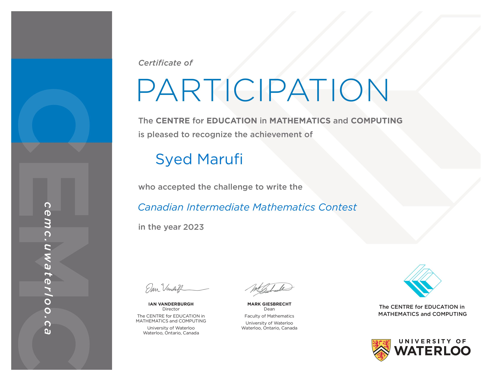

# <ins> Achievements: </ins>

### Sports Achievemnts:
- For my schools middle school Volleyball team, I placed second in both the indoor and beach tournaments.

**------------------------------------------------------------------------------------------------------------------------------------------------------------------------------------**

### Acedemic Achievements:
- I participated in the Waterloo Computing Competition and recieved a top 25% finish, below is the certificate.

**[Back To Home](README.md)**

**[My Hobbies and Intrests](Hobbies_and_Intrests.md)**

**[My Projects](My_Projects.md)**

