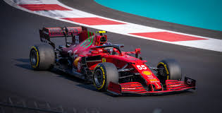
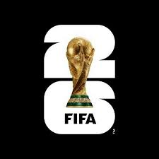
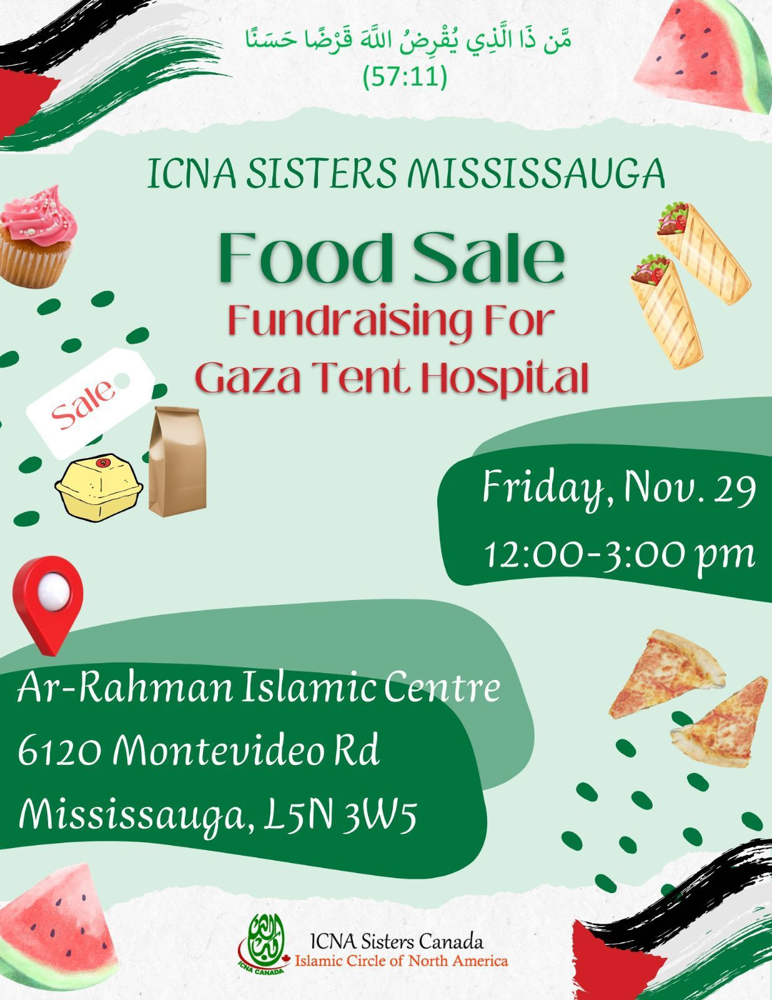

# <ins> My Hobbies & Intrests: </ins>

###  <ins> Sports: </ins>
- The sports I play and I am most intrested in are Volleyball and Badminton. These 2 sports require good ahnd-eye coordination along with lightining quick reaction times, both of which
I have. There are other sports I like to watch such as Formula 1 and Football. ALthough I dont play these sports, they are great to watch.

   

**------------------------------------------------------------------------------------------------------------------------------------------------------------------------------------**

### <ins> Hobbies: </ins>
- I dont have many hobbies as I usually play sports instead but a few hobbies I have are gardening and volunteering. During summer, I am frequently in my backyard taking care of the grass, removing weeds, leveling soil etc. For the past 2 years, i've been volunteering at an Islmic school, trying to teach others the way of Islam. Religion is something important to me and spreading religion lifts my status in the eyes of God. Below is an image of a food drive I volunteered at.

**[Back To Home](README.md)**

**[My Awards/Achievements](Achievements.md)**

**[My Projects](My_Projects.md)**
