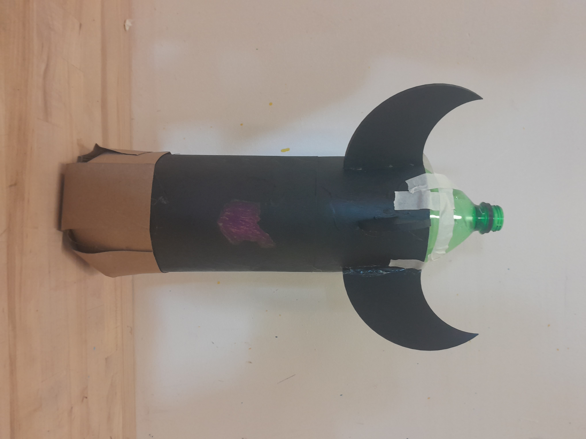

### Bottle Rocket Project
-This was a project I did in Grade 9 Design Tech. It was the first project of the year and the goal was to make a bottle rocket that would launch the furthest and prevent a payload (egg) from cracking upon imapct. Below is an image of the rocket and the video of the successfull launch.

<video controls width="640" height="360">
  <source src="docs/assets/Rocket_Launch.mp4" type="video/mp4">
</video>

[Back To Home](README.md)
