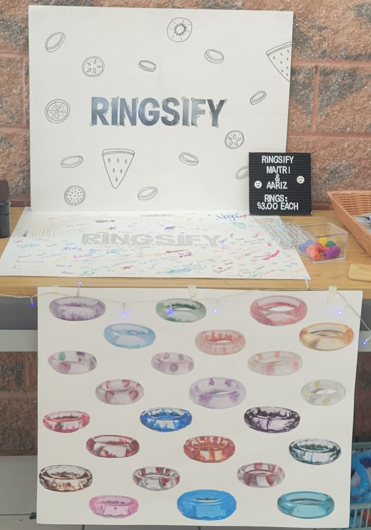

# Projects
## Many Projects I have done over the years:

### Bottle Rocket Project:
- This was a project I did in Grade 9 Design Tech. It was the first project of the year and the goal was to make a bottle rocket that would launch the furthest and prevent a payload (egg) from cracking upon imapct. Below is an image of the rocket and the video of the successfull launch.

<video controls width="300" height="360">
  <source src="docs/assets/Rocket_Launch.mp4" type="video/mp4">
</video>

**---------------------------------------------------------------------------------------------------------------------------------------------------------------------------------------------------**

### Roller Coaster Project:
- This was a project I did in Grade 9 Design Tech. For this project, our goal was to build a functioning marble roller coaster and earn the highest score. Points were calculated on, number of loops, diameter of loops, time from top to bottom and height from top to bottom. With all this combined my group came first place. We also went to Wonderland for this project. Below is an image of the project.

**---------------------------------------------------------------------------------------------------------------------------------------------------------------------------------------------------**

### Water Wheel Project:
- This was a project I did during Grade 9 Design Tech. The goal of this project was to be bale to use either water or wind to generate power. We accomplished this using gears and motors. We then powered an LED which was attatched to a background to act as a "Bat Signal". My group generated a total of 2.1 Volts, most in the class. Below are some of the images from the project.

**---------------------------------------------------------------------------------------------------------------------------------------------------------------------------------------------------**

### Business Project
- In the final year of IBT, we were able to team up and create our own business. We had to handle everything such as the product idea, design, materials cost, expenses, marketing and selling of the product. This project we were given free rign on, no rules to follow we could do whatever we wanted. The only goal was to break even. My partner and I were able to accomplish this and make a profit of $300. Below is an image of the stall we used to display and sell our products.

[Back To Home](README.md)
